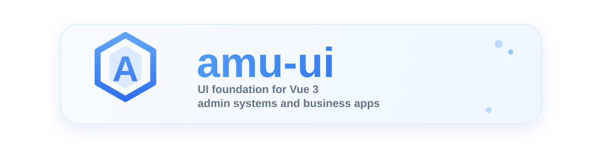

<p align="right">
	<a href="./README.md">English</a> | <a href="./README.zh-CN.md">简体中文</a>
</p>

<p align="center">
	
</p>

<p align="center">
	UI foundation for Vue 3 admin systems and business applications
</p>

<p align="center">
	<a href="https://github.com/1942847253/amu-ui/blob/main/LICENSE">
		
	</a>
	<a href="https://www.npmjs.com/package/amu-ui">
		
	</a>
	<a href="https://www.npmjs.com/package/amu-ui">
		
	</a>
	<a href="https://github.com/1942847253/amu-ui/stargazers">
		
	</a>
	<a href="https://github.com/1942847253/amu-ui/issues">
		
	</a>
	<a href="https://1942847253.github.io/amu-ui/">
		
	</a>
</p>

<p align="center">
	<a href="#highlights">Highlights</a> ·
	<a href="#packages">Packages</a> ·
	<a href="#quick-start">Quick Start</a> ·
	<a href="#workflow">Workflow</a>
</p>

`amu-ui` is more than a single component package. It is a complete Vue 3 UI toolkit and engineering workspace built around components, icons, theme tokens, locale, documentation, and playgrounds.

## Highlights

- Built with Vue 3 + TypeScript under a strict and maintainable engineering setup
- Includes 45+ business-oriented components across form, data display, feedback, layout, and navigation scenarios
- Supports both full installation and on-demand import for better DX and bundle control
- Ships ESM, CJS, and type declarations for modern and legacy build pipelines
- Uses CSS Variables for theming, including dark mode and semantic design tokens
- Generates component API docs from source definitions to reduce documentation overhead
- Splits icons, hooks, and locale into reusable packages for ecosystem growth

## Packages

| Package | Description |
| --- | --- |
| `amu-ui` | Main UI package with component exports, theme entry, and locale bridge |
| `@amu-ui/icons` | Standalone icon package with full install and on-demand import |
| `@amu-ui/hooks` | Reusable hooks package |
| `@amu-ui/locale` | Locale package and i18n type definitions |

## Quick Start

Install dependencies:

```bash
pnpm install
```

### Full Installation

```ts
import { createApp } from 'vue'
import App from './App.vue'
import AmuUI from 'amu-ui'
import 'amu-ui/theme'

createApp(App).use(AmuUI).mount('#app')
```

### On-demand Import

```vue
<script setup lang="ts">
import { AmuButton } from 'amu-ui/button'
</script>

<template>
	<AmuButton type="primary">Primary Button</AmuButton>
</template>
```

### Local Development

Start the playground:

```bash
pnpm dev
```

Start the docs site:

```bash
pnpm docs:dev
```

Build the full package ecosystem:

```bash
pnpm build
```

This command builds `@amu-ui/icons`, `@amu-ui/hooks`, and `@amu-ui/locale`, then regenerates package exports and builds the main `amu-ui` package.

Run tests:

```bash
pnpm test
```

## Workflow

| Command | Description |
| --- | --- |
| `pnpm dev` | Start playground for component development |
| `pnpm docs:dev` | Start the docs site |
| `pnpm build` | Build icons, hooks, locale, and the main package |
| `pnpm build:lib` | Build only the main component package |
| `pnpm type:check` | Run TypeScript type checking |
| `pnpm gen:exports` | Scan component directories and regenerate package exports |
| `pnpm test` | Run Vitest |
| `pnpm coverage` | Generate coverage reports |

## Repository Structure

```text
amu-ui
├─ packages/                 # components, icons, hooks, locale, theme, utils
├─ docs/                     # documentation site
├─ playground/               # local development playground
└─ sfc-playground/           # interactive SFC playground
```

### packages Overview

- `packages/components`: Main component source and public export entry
- `packages/icons`: SVG generation, icon components, and standalone build config
- `packages/hooks`: Shared composable hooks
- `packages/locale`: Locale resources and i18n typings
- `packages/theme`: Theme tokens and style foundation
- `packages/utils`: Installation helpers and shared internals

## Engineering Design

### Package Consumption

- The main package exposes both full-entry and component-level subpath exports
- Builds use preserveModules for tree-shaking and path-stable outputs
- Component styles are injected through the build pipeline for consistent usage

### Docs and API Automation

- The docs site is built with Vite + Vue Router instead of an external docs framework
- Component `props / emits / slots` are parsed at build time to generate API tables
- Demos and navigation are auto-wired from conventions to reduce maintenance work

### Theme and Locale

- The theme system is based on CSS Variables with dark mode and scoped theme switching
- Locale and hooks are split into standalone packages, with `ConfigProvider` handling injection

## Current Status

- The component library, docs site, and playgrounds can all be built independently
- Component tests are unified under the root Vitest workflow
- The repository is focused on the UI package ecosystem and its documentation tooling

## Release and Maintenance

Before publishing the `amu-ui` ecosystem packages, it is recommended to complete the following checks:

- Build the main package and all standalone subpackages
- Verify `exports` and on-demand import paths
- Confirm version bumps and dependency linkage are aligned

## License

Released under the MIT License. See `LICENSE` for details.
