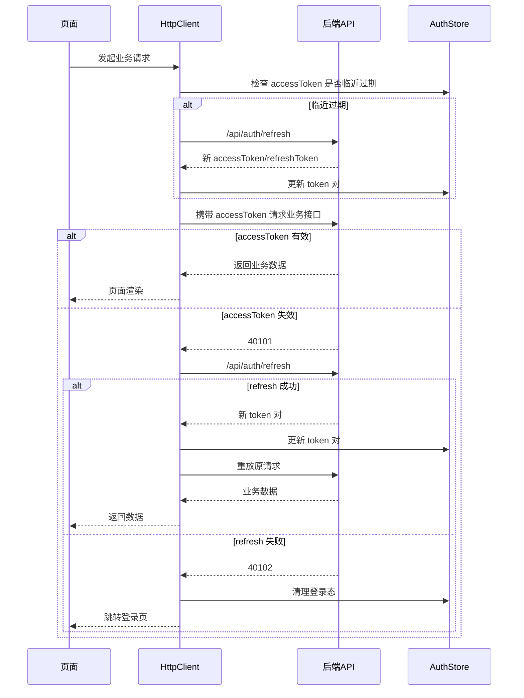

# amu-admin-template

基于 `Vue 3 + TypeScript + Pinia + Vue Router + amu-ui` 的后台管理前端模板，面向需要快速搭建权限后台、配置台、运营后台的业务系统。

## 模板定位

- 这是 `amu-ui` 仓库内维护的后台前端模板
- 默认对接同仓库下的 `templates/amu-admin-server`
- 当前模板已经具备“源码模式 / 包模式”两套依赖解析路径
- 依赖声明已改为真实 semver 版本，便于后续从 monorepo 中抽离
- 但它仍保留了对本仓库源码 alias 的可选支持，因此当前最适合的定位依然是仓库内生态示例、业务底座参考和独立模板候选

## 已内置能力

- RBAC 权限模型，覆盖用户、角色、权限点、菜单、部门等后台场景
- 动态路由注入与页面级权限守卫
- 指令级权限控制 `v-permission`
- 双 token 鉴权与刷新重放链路
- 并发请求下的刷新队列控制与请求取消
- 标签页导航、页面缓存、布局模式切换、主题与暗黑模式
- 内置 `示例` 菜单组，可直接查看表单、按钮组、表格、文本省略、Loading、弹窗抽屉、详情展示等后台常见页面写法
- 基于 `amu-ui` 与 `@amu-ui/icons` 的统一视觉与交互底座
- 默认联调真实服务端模板，而不是本地假数据 Mock

## 快速开始

### 前置条件

- 已在仓库根目录执行 `pnpm install`
- 服务端模板已可用
- Node.js、pnpm 版本与仓库其余子项目保持一致

### 环境配置

可先复制 `.env.example` 为 `.env`，按需调整以下字段：

- `VITE_DEV_PORT`：前端 dev server 端口，默认 `5174`
- `VITE_API_PROXY_TARGET`：本地开发时 `/api` 代理目标，默认 `http://localhost:3000`
- `VITE_API_BASE_URL`：生产环境后端地址；当你把前端单独部署到 GitHub Pages、Cloudflare Pages 等静态托管平台时使用
- `VITE_USE_WORKSPACE_SOURCE`：是否直接使用当前 monorepo 中的 `amu-ui` 与 `@amu-ui/icons` 源码；未显式配置时会自动探测当前目录是否存在 workspace 源码
- `VITE_APP_BASE_PATH`：前端访问基路径；根路径部署填 `/`，子路径部署可填 `/amu-admin/` 或 GitHub Pages 的 `/<repo>/`
- `VITE_APP_NAME`、`VITE_APP_SHORT_NAME`：应用名称与简写
- `VITE_APP_TITLE`、`VITE_APP_DESCRIPTION`：登录页和品牌展示文案的基础元信息
- `VITE_APP_COPYRIGHT`、`VITE_APP_REPOSITORY_URL`：页脚版权与仓库地址

### 依赖解析模式

模板现在支持两种前端依赖解析模式：

- 自动模式：不设置 `VITE_USE_WORKSPACE_SOURCE`
	- 默认模式
	- 如果当前目录附近存在 `../../packages/components/index.ts` 等 workspace 源码入口，则自动走源码模式
	- 如果当前模板已经脱离 monorepo，则自动回退到包模式
- 源码模式：`VITE_USE_WORKSPACE_SOURCE=true`
	- Vite 会直接 alias 到当前仓库 `packages/*` 源码
	- 适合在本 monorepo 内开发组件库与后台模板联调
- 包模式：`VITE_USE_WORKSPACE_SOURCE=false`
	- 不再走源码 alias，而是从 `node_modules` 中解析 `amu-ui` 与 `@amu-ui/icons`
	- 适合逐步验证模板脱离 monorepo 源码后的可运行性

### 依赖版本策略

- `amu-ui`：当前使用 `^2.1.0`
- `@amu-ui/icons`：当前使用 `^0.2.0`

这意味着：

- 在当前 monorepo 内安装依赖时，只要本地 workspace 版本满足范围，pnpm 仍可复用本地包
- 当你把模板抽到外部仓库时，也可以直接从 npm 解析同名包，而不需要再把依赖写成 `workspace:*`

如果你在当前仓库里切到包模式，请先确保 `amu-ui` 与 `@amu-ui/icons` 的构建产物已经存在；最直接的方式是先在仓库根目录执行一次：

```bash
pnpm build
```

### 推荐联调路径

先启动服务端：

```bash
pnpm run admin-server:start
```

如果你不使用 Docker，也可以改为本地方式启动服务端，具体见 `../amu-admin-server/README.md`。

再启动前端模板：

```bash
pnpm --filter amu-admin-template dev
```

默认开发地址通常为 `http://localhost:5174`，如果你修改了 `VITE_DEV_PORT`，请按新的端口访问；前端会将 `/api` 代理到 `VITE_API_PROXY_TARGET`。

### GitHub Pages 部署

如果你准备把前端单独部署到 GitHub Pages，而后端继续放在云服务器，请至少配置这两个变量：

- `VITE_API_BASE_URL`：填你的后端地址，例如 `http://124.220.71.44` 或 `https://api.example.com`
- `VITE_APP_BASE_PATH`：
	- 使用默认 GitHub Pages 地址时，填 `/<repo>/`，例如 `/amu-ui-new/`
	- 使用自定义域名时，通常填 `/`

示例：

```bash
VITE_API_BASE_URL=http://124.220.71.44
VITE_APP_BASE_PATH=/amu-ui-new/
VITE_USE_WORKSPACE_SOURCE=false
```

这样构建后的前端会从独立后端地址请求 `/api/*`，不会再把请求错误地发到 `github.io` 自身域名。

如果你使用仓库根目录下新增的 GitHub Actions 自动发布工作流，还需要在 GitHub 仓库的 `Settings -> Secrets and variables -> Actions -> Variables` 中配置：

- `AMU_ADMIN_API_BASE_URL`：后端地址，例如 `http://124.220.71.44`
- `AMU_ADMIN_PAGES_BASE_PATH`：可选；如果不填，工作流默认使用 `/<repo>/`

## 演示账号

- `admin / 123456`：超级管理员，拥有全部权限
- `operator / 123456`：运营角色，聚焦用户管理
- `audit / 123456`：审计角色，仅保留受限只读能力
- `security / 123456`：安全角色，包含策略矩阵、审计日志、鉴权调试等安全向页面

## 常用脚本

开发：

```bash
pnpm --filter amu-admin-template dev
```

构建：

```bash
pnpm --filter amu-admin-template build
```

测试：

```bash
pnpm --filter amu-admin-template test
```

监听模式：

```bash
pnpm --filter amu-admin-template test:watch
```

## 关键目录

- `src/router`：静态路由、动态注入与全局路由守卫
- `src/store/auth.ts`：登录态、token 生命周期、用户信息
- `src/store/permission.ts`：权限树、菜单树、动态路由生成
- `src/api/http.ts`：请求封装、401 刷新、重放与错误提示
- `src/layouts`：后台布局系统、顶栏、侧栏、标签栏、设置抽屉
- `src/views`：示例业务页面与权限页面
- `vitest.config.ts`、`tests/setup.ts`：模板自身测试配置与 jsdom 兜底，不再依赖仓库根 Vitest 配置

## 哪些内容是基础底座

以下内容通常不建议在初始接入阶段直接删除：

- `src/router/index.ts` 中的鉴权守卫与动态路由注入
- `src/store/auth.ts` 中的登录态与 token 刷新逻辑
- `src/store/permission.ts` 中的菜单树与路由生成逻辑
- `src/api/http.ts` 中的 401 刷新与失败回退链路

## 哪些内容可以裁剪

以下内容更偏模板示例，可按业务需要删减：

- 鉴权自测页
- 安全中心相关演示页
- 默认演示账号与展示文案
- 个性设置中的部分偏展示型开关

## 鉴权自测页

- 菜单路径：`系统管理 / 鉴权自测`
- 可验证场景：
  - 写入无效 `accessToken` 并观察自动刷新
  - 写入无效 `refreshToken` 并观察回退登录
  - 并发请求下刷新队列行为
  - 可取消请求行为
  - 一键脚本化回放刷新成功与刷新失败流程

## 图标规范

- 统一使用 `@amu-ui/icons` 提供的图标组件，不再手写 SVG 路径或 `h('svg')`
- 页面内图标统一使用 `AmuIcon` 包裹，推荐写法：`<AmuIcon><IconSearch /></AmuIcon>`
- 菜单、面包屑等动态图标场景，先通过函数返回 `IconXxx`，再使用：`<AmuIcon><component :is="iconComp" /></AmuIcon>`
- 不建议直接使用裸 `<component :is="IconXxx" />` 作为最终渲染写法，以免样式不一致

## 当前已知边界

- 模板虽然已经改为 semver 依赖并支持包模式，但仍保留了对 monorepo 源码 alias 的可选支持，距离完全独立模板还差最后一轮仓库外验证与脚手架化整理
- 生产环境 API 基地址需要按你的部署方式调整，开发环境默认只代理本地 `/api`
- 当前自动化验证以单测与构建验证为主，尚未补齐完整 E2E

## License

当前模板随仓库以 MIT License 提供，详见仓库根目录 `LICENSE`。

## 仓库外抽离

如果你准备把当前模板单独抽成一个独立仓库，可先参考 `EXTRACTION_CHECKLIST.md`。这份清单聚焦于目录清理、依赖来源、CI、README 改写和服务端协作方式，不再只讨论当前 monorepo 内的联调路径。

如果你想直接拿一份“独立仓库语义”的说明稿作为起点，可同时参考 `README.standalone.md`。

## 鉴权链路概览


