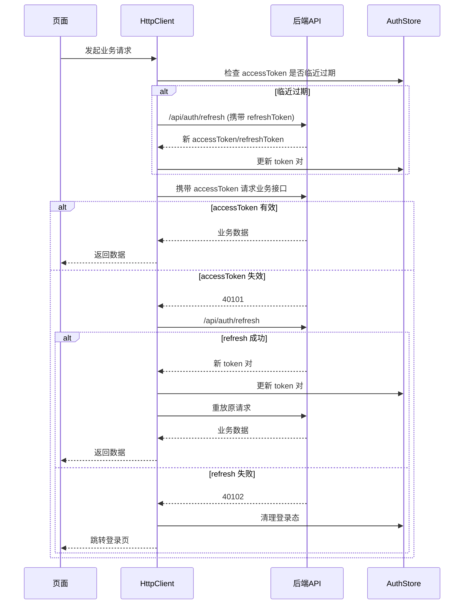

# amu-admin-template

基于 `Vue 3 + TypeScript + Pinia + Vue Router + amu-ui` 的企业级后台管理系统模板。

## 已内置能力

- RBAC 权限模型（角色 + 权限点）
- 真实后端对接（默认消费 `templates/amu-admin-server`）
- 动态路由注入（按权限过滤菜单与页面）
- 路由守卫（登录态校验 + 页面权限校验）
- 指令级权限控制（`v-permission`）
- 应用级状态（暗黑模式、侧边栏折叠）
- 多标签页导航（可关闭标签页）
- 路由缓存（基于 `meta.keepAlive` + `KeepAlive`）
- 请求层封装（请求/响应拦截器、重试、错误码映射）
- 请求层增强（取消请求、并发控制、401 刷新与请求重放）
- 统一错误提示（基于 `AmuMessage`）
- 双 token 鉴权（accessToken + refreshToken）
- 刷新窗口控制（过期前 30s 自动尝试刷新）

## 体验账号

- `admin / 123456`：超级管理员（全部权限）
- `operator / 123456`：运营角色（用户管理）
- `audit / 123456`：审计角色（仅仪表盘）
- `security / 123456`：安全角色（策略矩阵、审计日志、鉴权调试）

## 鉴权自测页

- 菜单路径：`系统管理 / 鉴权自测`
- 可验证场景：
	- 写入无效 `accessToken` 并观察自动刷新
	- 写入无效 `refreshToken` 并观察回退登录
	- 并发请求下刷新队列行为
	- 可取消请求行为
	- 一键脚本化回放（完整演示刷新成功与刷新失败回登录）

## 联调启动

先启动真实后端：

```bash
pnpm --filter amu-admin-server start:dev
```

再启动前端模板：

```bash
pnpm --filter amu-admin-template dev
```

前端开发环境已默认代理 `/api` 到 `http://localhost:3000`。

## 开发

```bash
pnpm --filter amu-admin-template dev
```

## 构建

```bash
pnpm --filter amu-admin-template build
```

## 测试

```bash
pnpm --filter amu-admin-template test
```

## 后续增强建议

- 接入日志埋点、异常上报与可观测性
- 增加 E2E 与视觉回归测试
- 增加用户、角色、权限点的新增/编辑/分配工作流

## 图标规范

- 统一使用 `@amu-ui/icons` 提供的图标组件，不再手写 SVG 路径或 `h('svg')`。
- 页面内图标统一使用 `AmuIcon` 包裹，推荐写法：`<AmuIcon><IconSearch /></AmuIcon>`。
- 菜单、面包屑等动态图标场景，先通过函数返回 `IconXxx`，再使用：`<AmuIcon><component :is="iconComp" /></AmuIcon>`。
- 禁止直接使用裸 `<component :is="IconXxx" />` 作为最终写法（需加 `AmuIcon` 外壳以保持样式一致）。

## 鉴权时序图


